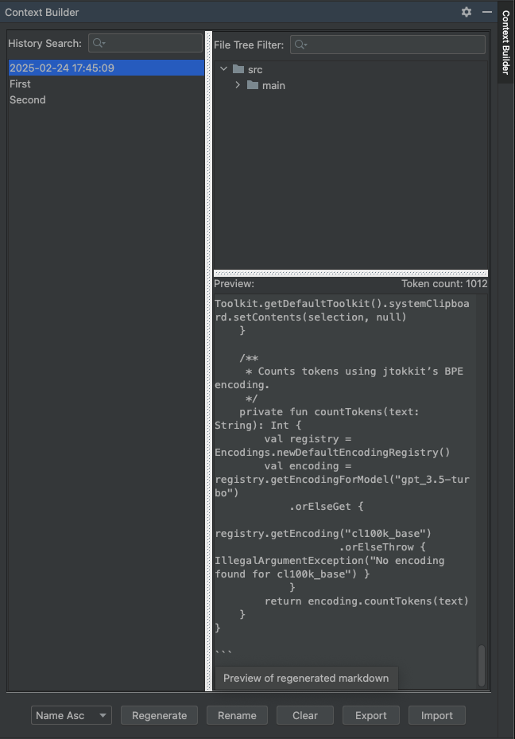

# ContextBuilder

ContextBuilder is an IntelliJ IDEA plugin that helps you generate and manage markdown contexts from selected project files. It provides a tool window with a history view, drag-and-drop support, and file filtering features—all designed to streamline your workflow for building context for AI prompts, documentation, or code reviews.

## Visual


## Features

- **Generate Context from Files:**  
  Generate a combined markdown context from selected files via a right-click action in the Project view.

- **Tool Window Interface:**  
  A docked tool window replicates the old modal dialog interface. It displays a history of generated contexts, a file tree view with preview, and a token count for the generated markdown.

- **Drag-and-Drop Support:**  
  Easily add files or entire folders to your history by dragging and dropping them onto the tool window. The plugin recursively collects all files from dropped directories.

- **History Management:**
    - **Sorting Options:**  
      Sort history entries by creation date (newest first) or by name.
    - **Renaming:**  
      Rename history entries to a custom label while still retaining the underlying date information.
    - **Filtering:**  
      Use a search field to filter history items and file tree contents.

- **Persistent State & Settings:**  
  The plugin persists your context history, file type exclusions, and markdown template across sessions. Adjust settings via the IntelliJ Settings/Preferences under Tools.

## Installation

1. **Clone or Download the Repository:**
   ```bash
   git clone https://github.com/YourOrgOrUser/ContextBuilder.git
   ```
2. **Build the Plugin:**  
   Use Gradle to build the plugin:
   ```bash
   ./gradlew buildPlugin
   ```
3. **Install in IntelliJ IDEA:**
    - Open IntelliJ IDEA.
    - Go to **File > Settings > Plugins** (or **Preferences > Plugins** on macOS).
    - Click the gear icon and select **Install Plugin from Disk...**.
    - Choose the generated plugin ZIP file from `build/distributions`.

## Usage

### Generating Context
- **Right-click Action:**  
  In the Project view, right-click on one or more files/folders and select **Generate Context**. This action generates a markdown context, copies it to the clipboard, and adds a new history entry.

### Using the Tool Window
- **View History:**  
  Open the **Context Builder** tool window (by default docked on the right side of the IDE) to view all generated context history.
- **Drag-and-Drop:**  
  Drag files or folders from the Project view directly onto the tool window to create new history entries.
- **Sort & Filter:**  
  Use the combo box to sort history by "Date Desc" (default) or "Name Asc". Use the search field to filter history items.
- **Rename History Entries:**  
  Select a history item and click **Rename** to assign a custom label.
- **Preview & Regenerate:**  
  Selecting a history entry displays its file tree and a markdown preview. Click **Regenerate** to copy the markdown to your clipboard.
- **Clear, Export, or Import History:**  
  Use the provided buttons to clear the history or to export/import your history as JSON.

## Project Structure

- **src/main/kotlin/com/brostoffed/contextbuilder/**
    - **ContextHistoryPersistentState.kt:**  
      Handles the persistent state of your context history, markdown template, and file type exclusions.
    - **GenerateContextAction.kt:**  
      Implements the right-click action for generating context from selected files.
    - **ContextBuilderSettingsConfigurable.kt:**  
      Provides the settings UI for file type exclusions.

- **src/main/kotlin/com/brostoffed/contextbuilder/toolwindow/**
    - **FileStructurePanel.kt:**  
      A simple panel that shows a flat file tree view and demonstrates drag-and-drop support.
    - **ContextHistoryToolWindowPanel.kt:**  
      The main tool window panel that replicates the old history dialog UI (history list, file tree, preview, sorting, renaming, etc.).
    - **ContextBuilderToolWindowFactory.kt:**  
      Registers and creates the tool window for the plugin.

- **src/main/resources/META-INF/plugin.xml:**  
  Plugin configuration file which registers actions, settings, tool window, and notification group.

- **src/main/resources/META-INF/pluginIcon.svg:**  
  The plugin icon.

## Building and Running

The project uses Gradle with the IntelliJ Gradle Plugin. To build and run:

1. **Build Plugin:**
   ```bash
   ./gradlew buildPlugin
   ```
2. **Run IDE with Plugin:**
   ```bash
   ./gradlew runIde
   ```

## Dependencies

- **Kotlin:** Language for implementation.
- **IntelliJ Platform SDK:** For building the plugin UI and integrating with the IDE.
- **jtokkit:** For token counting using BPE encoding.

## Contributing

Contributions are welcome! Please fork the repository and create a pull request with your changes. For major changes, please open an issue first to discuss what you would like to change.

## License

[MIT License](LICENSE)

---

This README provides an overview of the plugin's purpose, features, installation instructions, usage details, project structure, and build instructions. Feel free to adjust the text to match your specific requirements and repository details.
